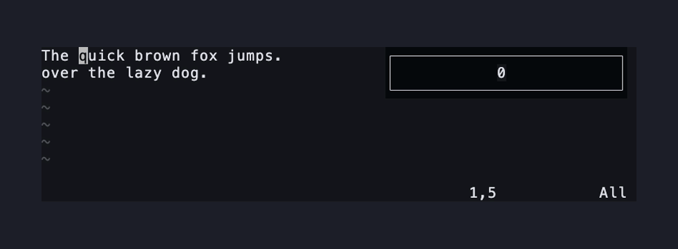
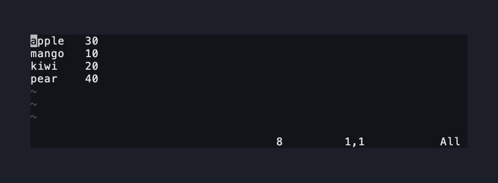
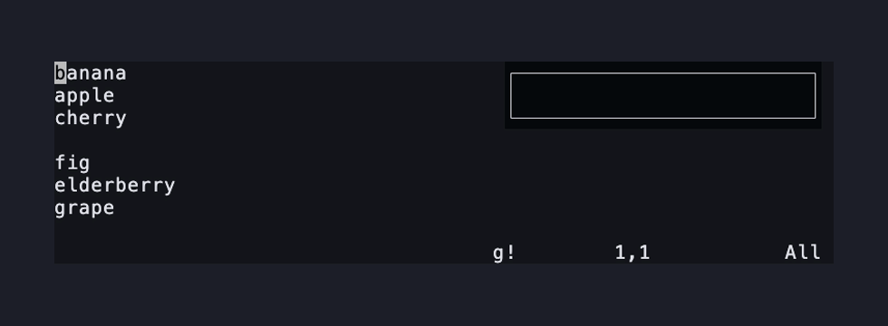
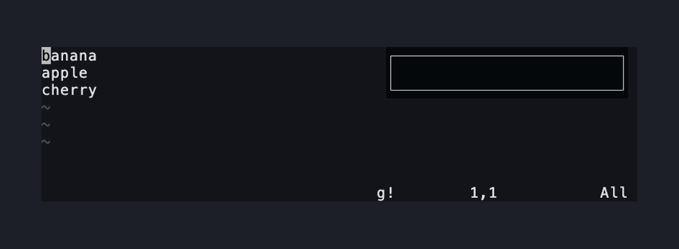

# bang.nvim

[](https://github.com/Nagato-Yuzuru/bang.nvim/actions/workflows/ci.yml)
[](https://neovim.io)
[](LICENSE)

Pipe a selection, motion, or text object through a shell command.

Vim's `!` filters whole lines. bang.nvim filters exactly the text a motion, a
text object or a Visual selection covers, charwise, linewise or blockwise, and
puts the command's output in its place.

A command that fails leaves the buffer
alone. Everywhere else it behaves as the built-in filter does, and
[`:help bang-differences`](doc/bang.txt) lists the exceptions.

## Install

Neovim 0.11 or newer, on a Unix-like system. Windows support is in progress
([#20](https://github.com/Nagato-Yuzuru/bang.nvim/issues/20)): `'shellquote'`
and `'shellxquote'` are still ignored.

With lazy.nvim:

```lua
{
  "Nagato-Yuzuru/bang.nvim"
   -- event = "VeryLazy",
}
```

With the package manager built into Neovim 0.12 (`:help vim.pack`):

```lua
vim.pack.add({ "https://github.com/Nagato-Yuzuru/bang.nvim" })
```

`g!`, `g!!` and `:Bang` are there once the plugin loads; no `setup()` call is
needed. Options live in `vim.g.bang`, and `:help bang-config` lists them.
`:checkhealth bang` says why the plugin does, or does not, work here.

## What it does

**A motion filters exactly the text it covers.** `g!iw`, then `tr a-z A-Z`: one
word changes, and the rest of the line stays.



**A Visual block filters one column.** In a list of names and numbers, `<C-v>`
down the numbers, then `g!` with `sort`. The numbers reorder; the names beside
them never move.



**`.` repeats the last run.** Same motion, same command, no prompt.



**A failing command leaves the buffer alone.** A mistyped command shows the
shell's error. Not a byte changes. To write the output anyway, as `!` does, set
`on_error = "replace"` in `vim.g.bang`, or use `:Bang!` for one run.



Every way in:

- `g!{motion}` opens a `!` prompt for a shell command and filters the text the
  motion covers, charwise or linewise as the motion is.
- `g!!` filters the current line, and `[count]g!!` filters `[count]` lines.
- `{Visual}g!` filters the selection, charwise, linewise or blockwise as it was made.
- `.` repeats the last `g!`. A `:Bang` in between does not change what it repeats.
- `:[range]Bang {cmd}` filters the lines of the range. Typed from a charwise or
  blockwise Visual selection, `:'<,'>Bang` filters the selection itself.
- `:[range]Bang! {cmd}` writes the output even when the command fails, which is
  what `diff` and `grep` need.
- `:Bang` with no command offers the past commands from the `:` history and runs
  the one you pick.

## Documentation

The full manual is [`:help bang.nvim`](doc/bang.txt).

## Edge cases

[Edge cases](demo/edge-cases.md).

## License

MIT
