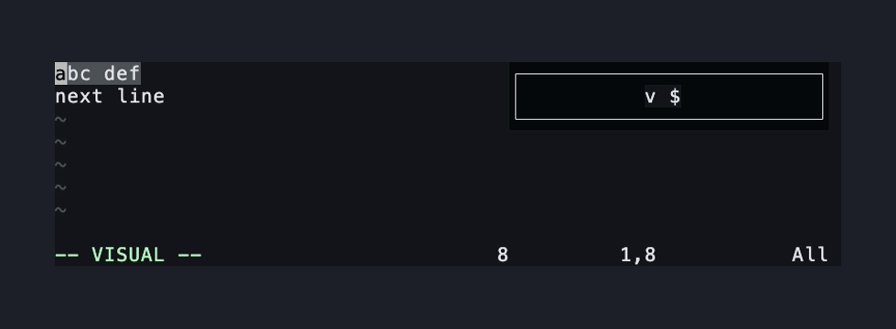
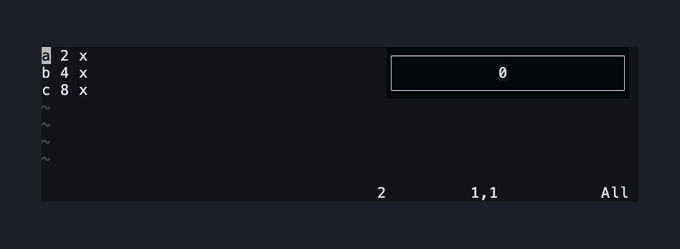
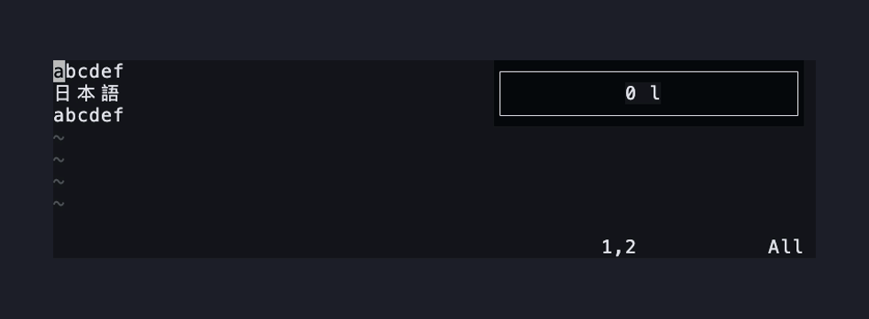
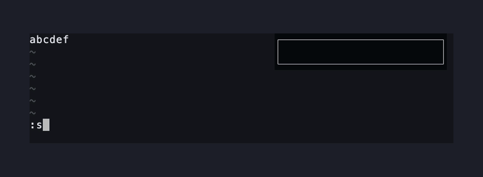
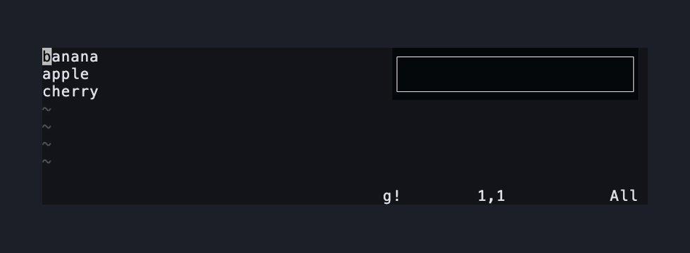

# Edge cases

Where Vim leaves a choice, bang.nvim does what the nearest built-in does. One
scene per ruling; `:help bang.nvim` states each rule exactly.

**A charwise `$` selection stops at the last character.** The line break stays
in the buffer, as `gU` leaves it. `v$`, then `g!` with `rev`: the line reverses
and the next line stays where it was.

**bang.nvim pads short output rows with spaces**, so the text to the right of
the block moves by the same amount on every line, as a blockwise `p` does. Where
the block runs off the end of a line the padding comes off again, the plugin's
own spaces only, so it never becomes trailing whitespace.

**A block edge inside a wide character takes the whole character**, as `gU`
does, and inside a `<Tab>` takes the whole tab. Splitting it into spaces, as `d`
and `c` do on a block, would change bytes outside the region.

**A command that writes nothing clears the block.** Every row goes empty and the
text after it moves left, the way `d` leaves it. Output with any other number of
rows than the block has is refused, and nothing is written.

**`'selection'` is honoured.** With `exclusive` the last character stays out,
from `g!` and from a typed `:'<,'>Bang` alike.

**With `expand_bang = true` in `vim.g.bang`, `!` in a command expands to the
previous command**, as the built-in filter does. bang.nvim remembers a command as
soon as it hands it to the shell, so a non-zero exit, a timeout and a `'shell'`
that never started all count. After a command that was not found, `echo !`
writes that command's name.

**A `readonly` buffer warns W10 once**, as any other change does. The warning is
Neovim's own, raised when the write saves undo state; the plugin adds none of
its own.

Not honoured yet: `:lockmarks` and `:keepmarks`. A run always moves `'[`, `']`
and the marks the new text displaces
([#21](https://github.com/Nagato-Yuzuru/bang.nvim/issues/21)).
